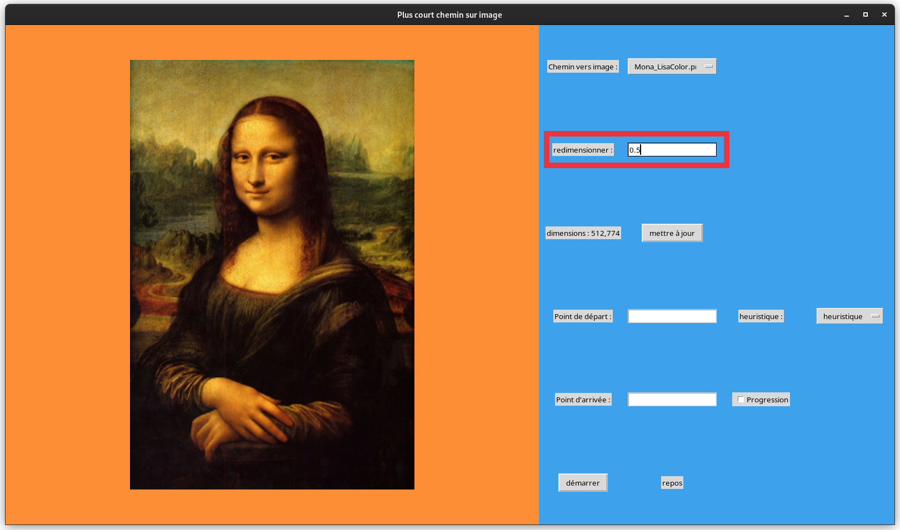
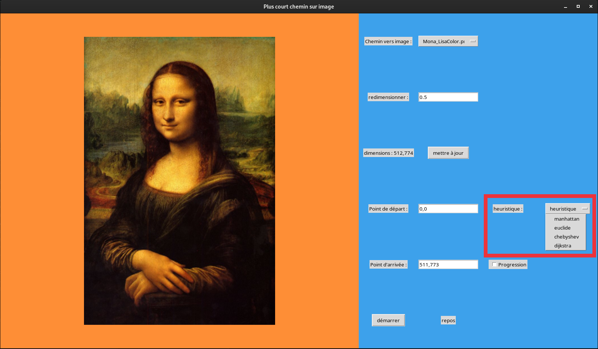

# Installation du projet
## Creation d'un environnement virtuel
Dans le répertoire du projet tapez :
```bash
python3 -m venv env
```
Puis :
```bash
source env/bin/activate
```
## Installation de PIllow
Une fois l'environnement virtuel créé et activé il vous faudra installer Pillow via pip :
```bash
pip install Pillow
```
## Lancement du projet
Lancez le projet en vous plaçant dans le répertoire src/ et en exécutant :
```bash
python3 main.py
```
# Utilisation de l'interface graphique
## Ajouter une image
Avant de lancer le projet, veuillez mettre l'image que vous souhaitez tester dans le répertoire res. 
Une fois dans l'interface, sélectionnez l'image via le menu déroulant en haut.
## Dimensions
Vous avez la possibilité de redimensionner l'image, pour se faire entrez le coefficient multiplicateur de votre choix, 
entrez un nombre > 1 pour diminuer la taille, entre 0 et 1 (exclus) pour l'augmenter.



## Bouton mettre à jour
Ce bouton permet d'afficher l'image une fois que vous avez changé ses dimensions, il permet aussi d'éffacer le résultat précédent.
## Points de départ et d'arrivée
Entrez les points sous ce format : x,y ; deux entiers séparés d'une virgule, x doit être entre 0 et largeur_image - 1, y doit être entre 0 et hauteur_image - 1.

## Heuristique
Vous pouvez choisir l'heuristique que vous voulez grâce au menu déroulant ci-dessous, à noter que ne rien choisir ou choisir Dijkstra produit le même effet.

## Progression
Cochez la case progression si vous souhaitez voir l'algorithme chercher le plus court chemin. Cette fonctionnalité est déconseillée sur les grosses images
en raison du temps que l'algorithme prendra à se terminer.
## Bouton démarrer
Une fois toutes les options renseignées vous pourrez cliquer sur le bouton démarrer pour lancer l'algorithme.
## Une fois l'algorithme terminé
Vous trouverez en dessous de l'image (si l'image est trop grosse augmentez la taille de la fenêtre) le poids du chemin ainsi que le
nombre de sommets visités par l'algorithme.

